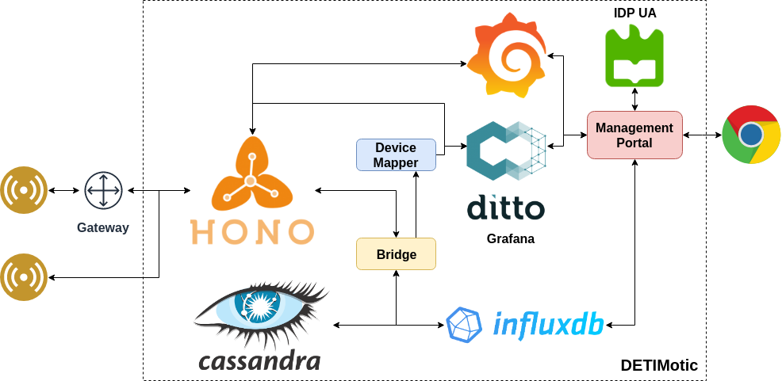
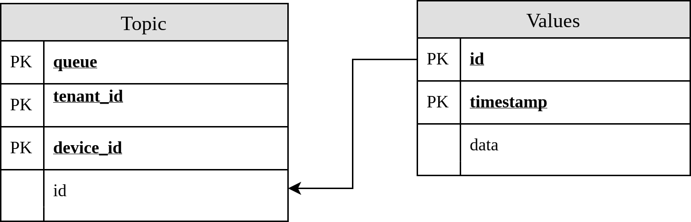
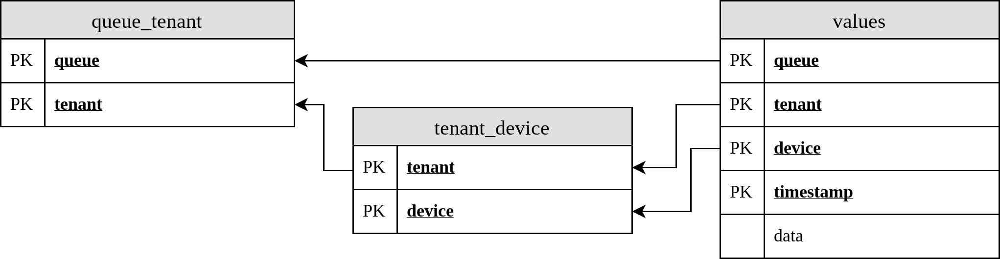

# Setup instructions for DETIMOTIC platform

## Proxmox (Deprecated)

Proxmox was used initially to provide virtual machine for the project.
Due to specific constraints, the machine were deployed on another platform.
Nevertheless the work done related with Proxmox can be found [here](Proxmox.md).

## Concepts

* **Topic/Queue** refers to one of the three types of queues supported by Hono (i.e. Telemetry, Event, Control)
  * **Event** Critical piece of data generated by a sensor, normally composed by a key and a value (e.g. Battery = 'critical')
  * **Telemetry** Piece of data generated by a sensor with real time constrains, it is only accepted if there is a application requesting it.
  * **Control** Queue used to send commands for the sensors (actuation)
* **Tenant** logic entity (project, group, company) that harbors a set of sensors
* **Sensor/Device** device that generates data and send it to the platform
* **Gateway** device that receives that from sensors and forwards them into the platform

## Architecture

The platform was develop with the most recent IoT protocols.
It is composed of several specific components.



The sensor can communicate directly with the platform, or through a gateway.
Several protocols can be used to send data directly to the platform (e.g. HTTP and MQTT).

* **Eclipse Hono** Broker used to received and forward the data from the sensors
* **Eclipse Ditto** Provides access to a digital twin of the devices
* **Grafana** Dashboard used to visualize data generated by the sensors
* **Apache Cassandra** Columnar database used to store all the data from the platform
* **InfluxDB** Time series database used to store all compatible data
* **Bridge** Subscribes all tenants from database and stores them into the databases
* **Device Mapper** Automatically creates and maps real devices into virtual ones
* **Management Portal** Portal used to manage the platform

## Access and login

The platform is composed of three machines:

Machine |       IP       | URL
--------|----------------|-----------------------------------------
Hono    | 192.168.85.107 | detimotic-1-pei2019.5g.cn.atnog.av.it.pt
Ditto   | 192.168.85.204 | detimotic-3-pei2019.5g.cn.atnog.av.it.pt
Storage | 192.168.85.101 | detimotic-2-pei2019.5g.cn.atnog.av.it.pt

All the machines are configure provide access with SSH.
Furthermore, all the machine have the following [ssh keys installed](keys).

It is recommended that users that want to access the machines to install the keys on their own computer.
This can be achieved by simply coping the keys to your local ssh folder:

```console
install -m 0600 keys/detimotic_rsa ~/.ssh/
install -m 0644 keys/detimotic_rsa.pub ~/.ssh/
```

After you can create a configuration file for ssh (~/.ssh/config):

```text
Host hono
User detimotic
HostName 192.168.85.107
IdentityFile ~/.ssh/detimotic_rsa

Host ditto
User detimotic
HostName 192.168.85.204
IdentityFile ~/.ssh/detimotic_rsa

Host storage
User detimotic
HostName 192.168.85.101
IdentityFile ~/.ssh/detimotic_rsa
```

Alternatively, you can access the machines by conventional login:

Login | Password
------|---------
detimotic | FZFzjiKT&#124;u%uV;[sMtRb*l(w6)H9Mbv.

In order to connect to the machine you need to be connected to the [VPN from the university](https://glua.ua.pt/vpn-tutorial/).

## [Eclipse Hono](https://www.eclipse.org/hono/)

In order to setup Hono in a single computer, run the following commands:

Install the latext version of Docker, instructions [here](https://docs.docker.com/install/linux/docker-ce/ubuntu/).

```console
docker swarm init
sudo groupadd docker
sudo usermod -aG docker $USER
sudo chown "$USER":"$USER" /home/"$USER"/.docker -R
sudo chmod g+rwx "$HOME/.docker" -R
sudo systemctl stop docker
sudo systemctl start docker
```

Log out and log in.

```console
mkdir -p ~/git
cd ~/git
git clone https://github.com/eclipse/hono.git
cd hono
mvn clean install -Ddocker.host=unix:///var/run/docker.sock -Pbuild-docker-image,metrics-prometheus
chmod +x deploy/target/deploy/docker/swarm_*.sh
```

In order to start or stop the service (inside Hono folder):

```console
./deploy/target/deploy/docker/swarm_deploy.sh
./deploy/target/deploy/docker/swarm_undeploy.sh
```

### Store telemetry data

By default the data sent to the queue telemetry is not stored.
The rational behind this is that telemetry is critical data that has real-time constraints.
However, if telemetry data needs to be stored by the databases one can use the configurations given [here](https://stackoverflow.com/questions/52988184/subscribe-to-all-tenants-using-a-wildcard-in-eclipse-hono).

**Atention:** this is not recommended by the developers of Hono.

Add the following configurations for QPid (found in deploy/src/main/config/qpid/qdrouterd-with-broker.json):

```text
["linkRoute", {
  "prefix": "event/",
  "direction": "in",
  "connection": "broker"
}],

["linkRoute", {
  "prefix": "event/",
  "direction": "out",
  "connection": "broker"
}],

["linkRoute", {
  "prefix": "telemetry/",
  "direction": "in",
  "connection": "broker"
}],

["linkRoute", {
  "prefix": "telemetry/",
  "direction": "out",
  "connection": "broker"
}],

["address", {
  "prefix": "telemetry/",
  "distribution": "balanced"
}],
```

## [Eclipse Ditto](https://www.eclipse.org/ditto/)

In order to setup Ditto in a single computer, run the following commands:

```console
sudo groupadd docker
sudo usermod -aG docker $USER
```

Install the latext version of Docker, instructions [here](https://docs.docker.com/install/linux/docker-ce/ubuntu/).
Install the latest version of docker compose, instructions [here](https://docs.docker.com/compose/install/).

```console
sudo chown "$USER":"$USER" /home/"$USER"/.docker -R
sudo chmod g+rwx "$HOME/.docker" -R
sudo systemctl stop docker
sudo systemctl start docker
```

Log out and log in.

```console
mkdir -p ~/git
cd ~/git
git clone https://github.com/eclipse/ditto.git
cd ditto/deployment/docker/
```

Create a new password for the system (instructions [here](https://github.com/eclipse/ditto/blob/master/deployment/docker/README.md))
Run the following commands to generate a hashed password:

 ```console
 openssl passwd -quiet
 ```

Paste the hashed password on the *nginx.htpasswd* file:

```console
$ cat nginx.htpasswd
# this file contains sample users and their hashed password
ditto:A6BgmB8IEtPTs
detimotic:nGO1oOdVga3RI
```

By default the user and password for the devops operations is **devops** and **foobar** respectevely.
If you want to change it, single repeat the previous steps, but add the password to the following file:

```console
$ cat sandbox/nginx-devops.htpasswd
devops:9ht07jdPD3.8U
```

In order to start or stop the service (inside Ditto folder):

```console
docker-compose up -d
docker-compose down
```

Check the logs after starting up:

```console
docker-compose logs -f
```

Open following URL to get started: [http://192.168.85.204:8080](http://192.168.85.204:8080)

## Storage

### [Apache Cassandra](http://cassandra.apache.org/) 

Setup Cassanda on a single machine with the following credentilas:

   Login  | Password
----------|---------
detimotic | detimotic

Run the following commands:

```console
wget -q -O - https://www.apache.org/dist/cassandra/KEYS | sudo apt-key add -
sudo sh -c 'echo "deb http://www.apache.org/dist/cassandra/debian 311x main" > /etc/apt/sources.list.d/cassandra.list'
sudo apt update
sudo apt install cassandra
```

Run the following command to verify the state of the node:

```console
nodetool status
```

In order to access the database through remote machine it is necessary a simple configuration.
Stop the database to change the default configuration:

```console
sudo systemctl stop cassandra
```

Edit the file /etc/cassandra/cassandra.yaml and change the following options:

```text
rpc_address: 0.0.0.0
broadcast_rpc_address: 192.168.85.101
```

After re-start the database:

```console
sudo systemctl start cassandra
```

Run the following commands to create a new user and password:

```console
cqlsh
CREATE ROLE detimotic with SUPERUSER = true AND LOGIN = true and PASSWORD = 'detimotic';
```

Each piece of data shared by Hono is uniquely identifiable by 4 fields (see [Concepts](#concepts)): topic, tenant, device and timestamp.
One possible SQL model to store this information is the following:



Following the [desnormalization](https://www.datastax.com/dev/blog/basic-rules-of-cassandra-data-modeling) methods related with Cassandra we get the following model:



In order to create the previous mentioned schema in the database, follow the following instructions (the schema is available [here](detimotic.cql)):

```console
cqlsh
source 'detimotic.cql'
```

The database can be accessed programatically with the following example:

```console
mkdir cqlsh
cd cqlsh
python3 -m venv venv
source venv/bin/activate
pip3 install cqlsh
cqlsh 192.168.85.101 -u detimotic -p detimotic -k detimotic
```

Tipical queries:

Description                     | Query
--------------------------------|---------------------------
Get all tenants                 | select * from queue_tenant
Get all devices                 | select * from tenant_device
Get last value                  | select * from values limit 1
Get values from specific device | select * from values where queue = <> and tenant = <> and device = <> order by tenant ASC device ASC timestamp desc 

### [InfluxDB](https://www.influxdata.com/) 

Setup Cassanda on a single machine with the following credentilas:

   Login  | Password
----------|---------
detimotic | detimotic

Run the following commands:

```console
wget -qO- https://repos.influxdata.com/influxdb.key | sudo apt-key add -
source /etc/lsb-release
echo "deb https://repos.influxdata.com/${DISTRIB_ID,,} ${DISTRIB_CODENAME} stable" | sudo tee /etc/apt/sources.list.d/influxdb.list
sudo apt-get update && sudo apt-get install influxdb
sudo systemctl unmask influxdb
sudo systemctl enable influxdb 
sudo systemctl start influxdb 
```

Enable authentication in the InfluxDB configuration file. For most Linux installations, the configuration file is located in /etc/influxdb/influxdb.conf.

In the [http] section of the InfluxDB configuration file (influxdb.conf), uncomment the auth-enabled option and set it to true, as shown here:

```text
[http]
  # Determines whether HTTP authentication is enabled.
  auth-enabled = true #
```

Restart the InfluxDB service for your configuration changes to take effect:

```console
sudo systemctl restart influxdb
```

Because authentication is enabled, you need to create an admin user before you can do anything else in the database. Run the curl command below:

```console
curl -XPOST "http://192.168.85.101:8086/query" --data-urlencode "q=CREATE USER detimotic WITH PASSWORD 'detimotic' WITH ALL PRIVILEGES"
```

Create a new database:

```console
influx
CREATE DATABASE detimotic
```

The database can be accessed programatically with the following example:

```console
mkdir influx
cd influx
python3 -m venv venv
source venv/bin/activate
pip3 install influx-prompt
influx-prompt -h 192.168.85.101 -u detimotic -w -d detimotic
```

Tipical queries:

Description                 | Query
----------------------------|---------------------------
Get all measurements        | shown measurements
Get values from measurement | select * from <>

## Bridge

For more information see [here](../bridge/README.md).

## Device Mapper

For more information see [here](../device_mapper/README.md).

## Authentication Portal

For more information see [here](../portal/README.md).

## Troubleshooting

### Docker bridges

If by any change the briges create by the docker swarm colides with some subnets, it is possible to change the default configurations.

#### Docker0

The commands to change the bridge docker0 where found [here](https://support.getjoan.com/hc/en-us/articles/115005951805-Change-the-Docker-default-subnet-IP-address).

Stop the Hono service, and run the following instructions:

```console
sudo systemctl stop docker
sudo vim /etc/docker/daemon.json
```

And write the following configuration:

```text
{
  "bip": "172.26.0.1/16"
}
```
And, finally, run the lines and start the hono service:

```console
sudo systemctl start docker
```

#### Docker_gwbridge

Use the following commands to change the configuration of the docker_gwbridge:
The information contained [here](https://github.com/docker/docker.github.io/blob/master/engine/swarm/networking.md) can also be helpful.

```console
$ docker network inspect docker_gwbridge
...
        "Containers": {
            "ingress-sbox": {
                "Name": "ingress-endpoint",
                "EndpointID": "2602f152850da55b1508adbbc980fff0e13a88c8b20e83aa7020eb8b102547f8",
                "MacAddress": "02:42:0a:ff:00:03",
                "IPv4Address": "10.255.0.3/16",
                "IPv6Address": ""
            }
        },
...
$ docker network disconnect -f docker_gwbridge gateway_ingress-sbox
$ docker network rm docker_gwbridge
docker_gwbridge
$ docker network create \
--subnet="10.20.0.0/16" \
--gateway "10.20.0.1" \
-o com.docker.network.bridge.enable_icc=false \
-o com.docker.network.bridge.name=docker_gwbridge \
-o com.docker.network.bridge.enable_ip_masquerade=true \
docker_gwbridge
```

## Further Information

[Hono - Github](https://github.com/eclipse/hono)

[Ditto - Github](https://github.com/eclipse/ditto)
